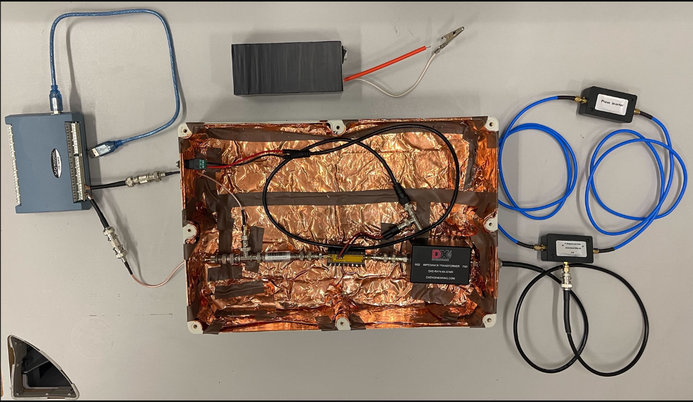
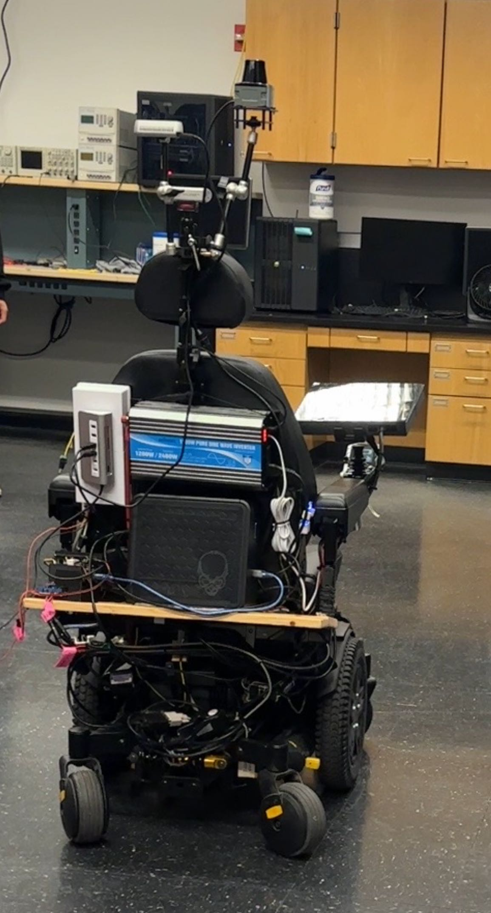
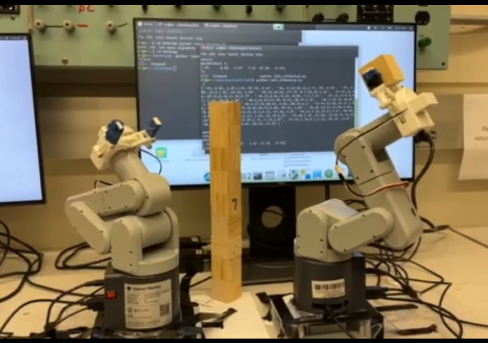

#   Prospective Graduate Student at John Hopkins University in MSE. Robotics

###   I am an Electrical and Computer Engineering senior at University of Washington, Seattle. 
###   During my undergraduate study, I was a research associate at UW Sensors, Energy, and Automation Laboratory(SEAL) directed by Prof. Alexander Mamishev.
###   My next stop is studying at John Hopkins University Laboratory for Computational Sensing + Robotics(LCSR) to finish my MSE in Robotics.

## My Projects
#### Embedded Antenna Signals Project - SEAL
- A project to design the signal-receiving module for the Heimdall ACU's antenna system to detect weak electromagnetic interference.
- It aims to detect the weak signal change when the meteorite events happen.

==
<figure class="third">
    
</figure>

#### Fruit Ripeness Project - SEAL
- The Fruit Ripeness Project aims to develop an innovative sensor that detects changes in fruit skin impedance, providing an accurate measure of fruit ripeness. [LINK](https://www.uwseal.org/project-showcase/)
  
==
<figure class="third">
    
</figure>
    
## My Resume 我的简历
- [View my resume](Resume.pdf)
- [查看我的简历](Resume2.pdf)

## Project Videos 项目视频
- [2024 UW ENGINE Cpastone Project](https://youtu.be/KzpJeC7L7hM)

==
<figure class="third">
    
</figure>

- [My undergrad course projects](https://youtu.be/1jFw59NL1z8)

==
<figure class="third">
    
</figure>
